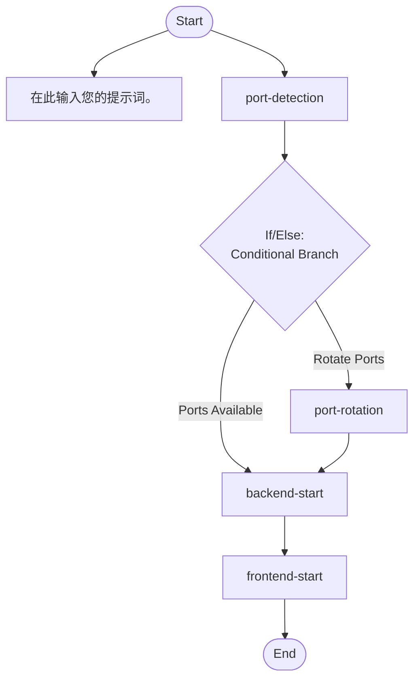

## Workflow Execution Guide

Follow the Mermaid flowchart above to execute the workflow. Each node type has specific execution methods as described below.

### Execution Methods by Node Type

- **Rectangle nodes**: Execute Sub-Agents using the Task tool
- **Diamond nodes (AskUserQuestion:...)**: Use the AskUserQuestion tool to prompt the user and branch based on their response
- **Diamond nodes (Branch/Switch:...)**: Automatically branch based on the results of previous processing (see details section)
- **Rectangle nodes (Prompt nodes)**: Execute the prompts described in the details section below

### Prompt Node Details

#### prompt_1768650284046(在此输入您的提示词。)

```
在此输入您的提示词。

您可以使用{{variableName}}这样的变量。
```

### If/Else Node Details

#### if_ports_available(Binary Branch (True/False))

**Evaluation Target**: frontendPort

**Branch conditions:**
- **Ports Available**: frontendPort != null && backendPort != null
- **Rotate Ports**: frontendPort == null || backendPort == null

**Execution method**: Evaluate the results of the previous processing and automatically select the appropriate branch based on the conditions above.
