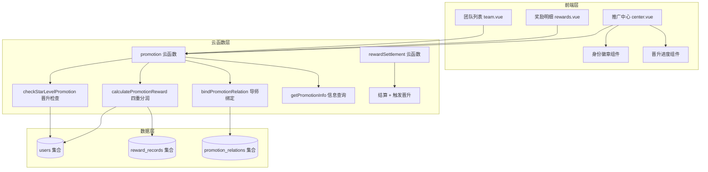

## 产品概述

按照 PROMOTION_SYSTEM.md 技术白皮书，将现有分销体系升级为"星级身份 + 代理层级"双轨制分销系统，实现毫秒级业绩计算与即时晋升机制。

## 核心功能

### 1. 双轨制身份体系

- 废弃现有 `promotionLevel` 字段，采用 `starLevel`(星级) + `agentLevel`(代理等级) 双轨制
- 代理层级 (0-4级)：决定基础佣金比例 (5%-20%)
- 星级身份 (0-3星)：决定额外权益 (复购奖/管理奖/育成奖)

### 2. 四重分润算法

- 基础佣金：按 agentLevel 确定比例
- 复购奖励：starLevel >= 1 额外 3%
- 团队管理奖：starLevel >= 2 级差制 2%
- 育成津贴：存在 mentorId 额外 2%

### 3. 即时晋升引擎

- 铜牌晋升：累计销售额 >= 20,000 或 直推 >= 30人
- 银牌晋升：本月销售额 >= 50,000 或 团队人数 >= 50人
- 跨月自动重置 monthSales

### 4. 前端可视化

- 身份徽章展示（星级 + 代理等级）
- 晋升进度条（距离下一级差额）
- 收益明细标记奖励来源类型

## 技术栈

- 后端：CloudBase 云函数 (Node.js)
- 数据库：CloudBase 文档型数据库
- 前端：Vue 3 + TypeScript + uni-app
- 组件库：TDesign (小程序适配)

## 技术架构

### 系统架构图



### 数据模型设计

**PromotionUser 更新字段：**

```typescript
interface PromotionUser {
  _id?: string;
  _openid?: string;
  nickName: string;
  avatarUrl: string;
  inviteCode: string;
  parentId?: string;
  
  // === 新增双轨制字段 ===
  starLevel: 0 | 1 | 2 | 3;           // 星级身份
  agentLevel: 0 | 1 | 2 | 3 | 4;      // 代理层级
  performance: {                       // 业绩追踪
    totalSales: number;                // 累计销售额(分)
    monthSales: number;                // 本月销售额(分)
    monthTag: string;                  // 跨月标识 "2026-02"
    directCount: number;               // 直推有效人数
    teamCount: number;                 // 团队总人数
  };
  mentorId?: string;                   // 育成导师ID
  
  // === 保留字段 ===
  totalReward: number;
  pendingReward: number;
  isSuspicious?: boolean;
  createTime?: Date;
}
```

**RewardRecord 新增字段：**

```typescript
interface RewardRecord {
  // ...existing fields
  rewardType: 'commission' | 'repurchase' | 'management' | 'nurture';
  rewardTypeName: string;  // "基础佣金" | "复购奖励" | "团队管理奖" | "育成津贴"
}
```

## 实现要点

### 1. 四重分润算法核心逻辑

- **基础佣金**：按 agentLevel 匹配比例 (1级=20%, 2级=15%, 3级=10%, 4级=5%)
- **复购奖励**：检查订单是否复购 + 上级 starLevel >= 1
- **团队管理奖**：级差制计算，上级所得 = 2% - 下级已拿比例
- **育成津贴**：遍历上级链条检查 mentorId 绑定关系

### 2. 晋升检查时机

- 订单结算后立即检查（在 rewardSettlement 云函数中）
- 使用 `db.command.inc` 原子更新业绩
- 晋升条件满足即刻 `update({ starLevel: x })`

### 3. 数据迁移策略

- 所有现有用户设置：`starLevel=0`, `agentLevel=4`, `performance` 初始值
- 保留 `promotionLevel` 字段但不再使用（兼容性考虑）
- 通过云函数批量更新，支持分页处理大量用户

### 4. 导师绑定机制

- 用户首次进入推广中心时可选择绑定导师
- 导师需存在且有效（已注册推广员）
- 绑定后不可更改

## 目录结构

```
/Users/johnny/Desktop/小程序/perfectlifeexperience/
├── src/
│   ├── types/
│   │   └── index.ts                 # [MODIFY] 更新 PromotionUser 类型定义
│   ├── components/
│   │   ├── PromotionBadge.vue       # [NEW] 身份徽章组件
│   │   └── PromotionProgress.vue    # [NEW] 晋升进度条组件
│   └── pages/promotion/
│       ├── center.vue               # [MODIFY] 添加徽章和进度条展示
│       ├── rewards.vue              # [MODIFY] 奖励类型标签展示
│       └── team.vue                 # [MODIFY] 显示成员星级/代理等级
├── cloudfunctions/
│   ├── promotion/
│   │   ├── index.js                 # [MODIFY] 重写分润算法+晋升引擎
│   │   └── migration.js             # [NEW] 数据迁移云函数
│   └── rewardSettlement/
│       └── index.js                 # [MODIFY] 结算时触发晋升检查
└── cloudbaserc.json                 # [MODIFY] 添加 migration 云函数配置
```

## 设计风格

采用现代简约风格，配合小程序特性，使用渐变色彩和圆角卡片设计，突出身份等级的尊贵感。

## 页面设计要点

### 推广中心首页改造

- 顶部用户信息区：显示双轨制身份徽章（星级+代理等级并列展示）
- 晋升进度卡片：进度条可视化距离下一级的差额
- 收益统计区：分类展示四种奖励类型累计收益

### 身份徽章设计

- 代理等级徽章：使用金色渐变背景 + 罗马数字 (I/II/III/IV)
- 星级徽章：使用铜/银/金色彩 + 星星图标

### 晋升进度条

- 双进度条设计：金额进度 + 人数进度（满足其一即可晋升）
- 进度条颜色：渐变从浅到深
- 剩余差额文字提示

### 奖励明细类型标签

- 基础佣金：蓝色标签
- 复购奖励：绿色标签
- 团队管理奖：紫色标签
- 育成津贴：橙色标签

## MCP 工具使用

### CloudBase MCP

- **getFunctionList**: 查询现有云函数列表，确认 promotion 和 rewardSettlement 函数状态
- **updateFunctionCode**: 更新 promotion 和 rewardSettlement 云函数代码
- **createFunction**: 创建新的 migration 迁移云函数
- **readNoSqlDatabaseStructure**: 查询现有数据库集合结构
- **writeNoSqlDatabaseContent**: 执行数据迁移脚本
- **invokeFunction**: 调用迁移云函数执行批量数据更新

## SubAgent 使用

### code-explorer

- 在实施过程中如需深入了解特定模块实现细节，可调用此代理进行代码探索