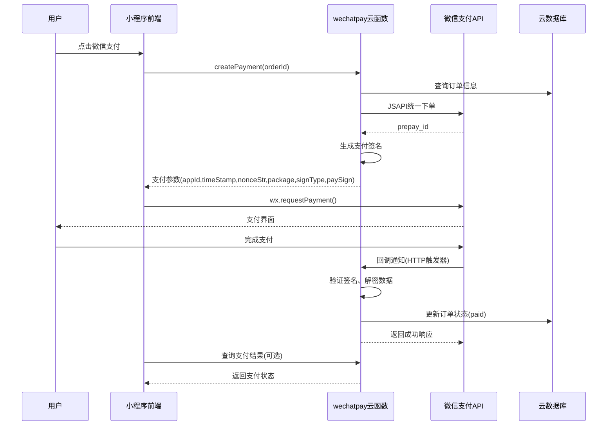

## 用户需求

用户需要在微信小程序项目中接入微信支付功能。由于使用的是云开发个人版环境，不支持 `cloud.cloudPay` 云调用方式，因此必须使用 HTTP 方式调用微信支付 V3 API。

## 产品概述

为现有的"大友元气精酿啤酒屋"微信小程序添加微信支付功能，实现完整的支付闭环，包括：

- 统一下单接口
- 支付参数生成与前端调起
- 支付回调处理
- 订单状态自动更新
- 支付结果查询

## 核心功能

1. **支付云函数**：创建 `wechatpay` 云函数，封装微信支付 V3 API 调用逻辑
2. **签名与证书管理**：实现 RSA-SHA256 签名、证书解析、平台证书下载
3. **支付流程集成**：修改订单确认页和订单详情页，接入真实微信支付
4. **回调处理**：创建 HTTP 触发器接收微信支付回调通知
5. **配置管理**：商户号、API密钥等敏感信息使用环境变量管理

## Tech Stack Selection

- **运行环境**: Node.js 18.15 云函数
- **加密库**: `crypto` (Node.js 内置) - RSA-SHA256 签名、AES-256-GCM 解密
- **HTTP 客户端**: `node-fetch` 或内置 `https` 模块
- **证书管理**: 支持 PEM 格式证书和私钥
- **现有依赖**: 复用项目已有的 `wx-server-sdk`

## Implementation Approach

采用 **微信支付 V3 API** 实现支付功能，核心流程如下：

1. **统一下单**：云函数调用微信支付 JSAPI 下单接口，生成 prepay_id
2. **签名生成**：使用商户私钥生成 RSA-SHA256 签名
3. **前端调起**：返回支付参数给小程序，调用 `wx.requestPayment`
4. **回调处理**：微信服务器异步通知，验证签名后更新订单状态
5. **证书管理**：首次运行时下载微信支付平台证书并缓存

**关键技术决策**：

- 使用 V3 API（而非 V2），签名更安全，支持自动证书下载
- 敏感信息（商户私钥、APIv3密钥）存储在云函数环境变量中
- 回调处理使用云函数 HTTP 触发器，无需额外服务器

## Implementation Notes

### 性能与安全考量

- **签名缓存**: 签名算法计算量大，避免重复计算
- **证书缓存**: 平台证书有效期较长，下载后缓存在云函数内存或云存储
- **幂等处理**: 回调可能重复通知，需保证订单状态更新的幂等性
- **金额单位**: 微信支付使用"分"为单位，项目已使用分为单位，无需转换

### 错误处理

- 支付失败时返回明确错误码，便于前端处理
- 回调验证失败时记录日志但不抛出异常（避免微信重试）
- 网络超时设置合理值（建议 10-15 秒）

### 敏感信息管理

- 商户私钥存储在云函数环境变量（Base64 编码）
- APIv3 密钥存储在云函数环境变量
- 回调通知的敏感字段需解密（如退款状态中的银行卡号等）

## Architecture Design



## Directory Structure

```
cloudfunctions/
├── wechatpay/                    # [NEW] 微信支付云函数
│   ├── index.js                  # 主入口，处理支付请求和回调
│   ├── pay.js                    # 统一下单、签名生成逻辑
│   ├── notify.js                 # 回调处理逻辑
│   ├── cert.js                   # 证书管理（下载、缓存平台证书）
│   ├── sign.js                   # RSA-SHA256 签名工具
│   ├── decrypt.js                # AES-256-GCM 解密工具
│   ├── package.json              # 依赖配置
│   └── README.md                 # 使用说明文档

cloudfunctions/order/
└── index.js                      # [MODIFY] 添加支付状态查询接口

src/pages/order/
├── confirm.vue                   # [MODIFY] 修改微信支付流程，调用真实支付
└── detail.vue                    # [MODIFY] 添加真实微信支付功能

src/utils/
└── api.ts                        # [MODIFY] 添加微信支付相关API封装

cloudbaserc.json                  # [MODIFY] 添加wechatpay云函数配置
```

## Key Code Structures

### 支付参数接口

```typescript
interface WechatPayParams {
  appId: string;
  timeStamp: string;
  nonceStr: string;
  package: string;  // prepay_id=xxx
  signType: 'RSA';
  paySign: string;
}

interface CreatePaymentRequest {
  orderId: string;
  openid: string;
  total: number;    // 分为单位
  description: string;
}

interface PaymentNotifyData {
  id: string;
  create_time: string;
  resource_type: string;
  event_type: string;
  summary: string;
  resource: {
    original_type: string;
    algorithm: string;
    ciphertext: string;
    associated_data: string;
    nonce: string;
  };
}
```

### 签名函数签名

```typescript
// 生成 RSA-SHA256 签名
function generateSignature(message: string, privateKey: string): string;

// 验证微信回调签名
function verifySignature(
  timestamp: string,
  nonce: string,
  body: string,
  signature: string,
  publicKey: string
): boolean;

// 解密回调通知中的敏感数据
function decryptResource(
  ciphertext: string,
  associatedData: string,
  nonce: string,
  apiV3Key: string
): object;
```

## Agent Extensions

### MCP

- **cloudbase**
- Purpose: 创建和部署微信支付云函数，配置HTTP触发器接收回调
- Expected outcome: `wechatpay` 云函数成功部署，HTTP触发器配置完成

### SubAgent

- **code-explorer**
- Purpose: 探索现有的云函数结构、API调用模式和数据库集合结构
- Expected outcome: 确认代码复用模式和现有架构约定