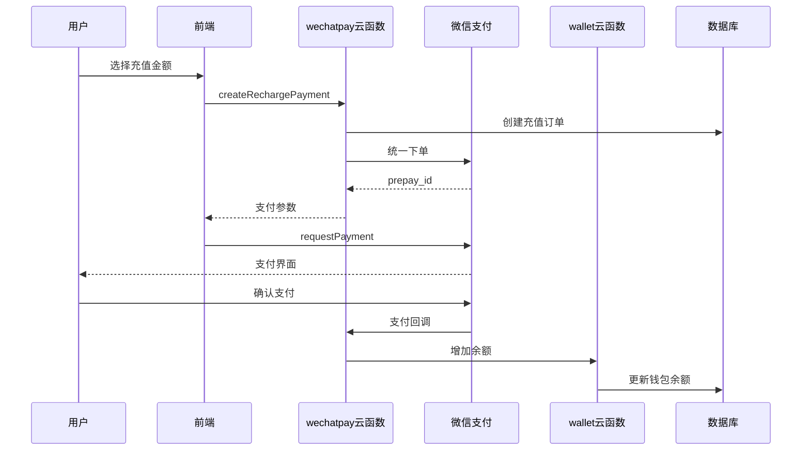

## 用户需求

用户要求：

1. **订单中心立即支付** - 已修复，需要确认可以正常工作
2. **钱包充值接入微信支付** - 当前是模拟支付，需要接入真实微信支付流程

## 核心功能

### 1. 订单支付（已实现）

- 订单详情页点击"立即支付"调起微信支付
- 支付成功后自动更新订单状态

### 2. 钱包充值支付（新增）

- 充值页面选择金额后点击支付
- 调用微信支付云函数创建充值订单
- 唤起微信支付界面
- 支付成功后自动增加钱包余额

## 技术方案

### 修改文件列表

1. **`cloudfunctions/wechatpay/index.js`** [MODIFY]

- 新增 `createRechargePayment` action：创建充值支付订单
- 修改 `handleNotify` 回调处理：区分订单支付和充值支付

2. **`cloudfunctions/wechatpay/notify.js`** [MODIFY]

- 新增 `handleRechargeSuccess` 函数：处理充值支付成功
- 根据订单号前缀区分订单类型（DY开头为订单，RC开头为充值）

3. **`src/pages/wallet/recharge.vue`** [MODIFY]

- 修改 `handleRecharge` 函数：接入微信支付流程
- 添加支付成功/失败处理

4. **`src/utils/api.ts`** [MODIFY]

- 新增 `createRechargePayment` 函数：调用充值支付云函数

### 数据库设计

新增 `recharge_orders` 集合：

```javascript
{
  _id: string,
  _openid: string,
  orderNo: string,        // 格式: RC + 时间戳
  amount: number,         // 充值金额（分）
  giftAmount: number,     // 赠送金额（分）
  status: string,         // pending/paid/failed
  createTime: Date,
  payTime: Date,
  transactionId: string   // 微信支付订单号
}
```

### 支付流程

