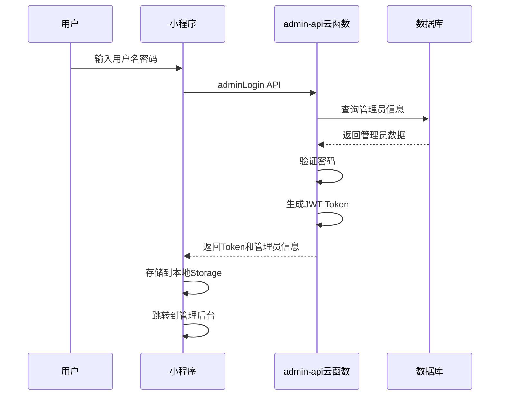

# 小程序端管理后台登录指南

**更新日期**: 2026-02-24

---

## 📱 快速开始

### 方式一：微信开发者工具测试（推荐）

#### 第一步：编译小程序

```bash
# 在项目根目录
cd /Users/johnny/Desktop/小程序/perfectlifeexperience

# 编译微信小程序
npm run dev:mp-weixin
```

#### 第二步：打开微信开发者工具

```bash
# macOS
/Applications/wechatwebdevtools.app/Contents/MacOS/cli open --project "/Users/johnny/Desktop/小程序/perfectlifeexperience"
```

#### 第三步：进入管理后台登录页

1. 在模拟器中，点击右上角 **"清缓存"** → **"全部清除"**
2. 在调试器的 **"AppData"** 标签中，手动添加路径跳转：
   ```
   /pagesAdmin/login/index
   ```
3. 或者在代码中添加临时跳转（在 `src/pages/index/index.vue` 的 onLoad 中）：
   ```javascript
   uni.navigateTo({
     url: '/pagesAdmin/login/index'
   })
   ```

#### 第四步：使用默认账号登录

```
用户名: admin
密码: admin123
```

#### 第五步：登录成功

登录成功后会自动跳转到管理后台首页。

---

### 方式二：真机调试（需要真机预览）

#### 第一步：确保已初始化管理员账号

在微信开发者工具的云函数控制台中：

1. 点击 **"云开发"** 按钮
2. 进入 **"云函数"** 列表
3. 找到 `initAdminData` 云函数
4. 点击 **"云端测试"**
5. 点击 **"调用"** 按钮

返回结果应该显示：
```json
{
  "code": 0,
  "message": "Admin collections initialized successfully",
  "data": {
    "adminId": "xxx",
    "defaultUsername": "admin",
    "defaultPassword": "admin123"
  }
}
```

如果显示 "Admin collections already initialized"，说明已经初始化过了。

#### 第二步：预览小程序

1. 在微信开发者工具中，点击 **"预览"** 按钮
2. 使用微信扫描二维码
3. 在手机上打开小程序

#### 第三步：进入管理后台

在小程序的任意页面，通过以下方式进入管理后台：

**方法1：添加管理入口**（推荐）

在 `src/pages/user/user.vue` 中添加管理后台入口：

```vue
<template>
  <view class="user-page">
    <!-- 其他内容 -->

    <!-- 管理后台入口 -->
    <view class="admin-entry" @click="goToAdmin">
      <text class="admin-icon">⚙️</text>
      <text class="admin-text">管理后台</text>
    </view>
  </view>
</template>

<script setup lang="ts">
const goToAdmin = () => {
  uni.navigateTo({
    url: '/pagesAdmin/login/index'
  })
}
</script>

<style scoped>
.admin-entry {
  display: flex;
  align-items: center;
  padding: 30rpx;
  background: #fff;
  margin-top: 20rpx;
}

.admin-icon {
  font-size: 40rpx;
  margin-right: 20rpx;
}

.admin-text {
  font-size: 28rpx;
  color: #333;
}
</style>
```

**方法2：直接输入路径**

在微信开发者工具的调试器控制台中：
```javascript
wx.navigateTo({
  url: '/pagesAdmin/login/index'
})
```

#### 第四步：登录

使用默认账号登录：
```
用户名: admin
密码: admin123
```

---

## 🔐 默认管理员账号

| 字段 | 值 | 说明 |
|------|---|------|
| 用户名 | `admin` | 默认超级管理员 |
| 密码 | `admin123` | ⚠️ 生产环境必须修改！ |
| 角色 | `super_admin` | 拥有所有权限 |
| 状态 | `active` | 账号激活 |

### ⚠️ 安全警告

**默认密码仅用于测试，生产环境必须修改！**

修改密码方式：
```javascript
// 在微信开发者工具的云函数控制台
// 选择 admin-api 云函数
// 云端测试，参数如下：
{
  "action": "changePassword",
  "data": {
    "oldPassword": "admin123",
    "newPassword": "your_new_secure_password"
  }
}
```

---

## 📋 登录流程说明

### 技术实现

1. **用户输入**: 用户名和密码
2. **API调用**: 调用 `admin-api` 云函数的 `adminLogin` 接口
3. **验证**: 云函数验证用户名和密码
4. **返回信息**: 返回管理员信息和JWT token
5. **本地存储**: 存储管理员信息和token
6. **跳转**: 跳转到管理后台首页

### 认证流程



---

## 🎯 登录后的操作

### 管理后台功能列表

登录成功后，可以访问以下功能：

| 页面 | 路径 | 功能 |
|------|------|------|
| 仪表盘 | `/pagesAdmin/dashboard/index` | 数据概览、统计 |
| 订单管理 | `/pagesAdmin/orders/list` | 查看、处理订单 |
| 商品管理 | `/pagesAdmin/products/list` | 商品增删改查 |
| 用户管理 | `/pagesAdmin/users/list` | 用户信息查看 |
| 财务管理 | `/pagesAdmin/finance/index` | 提现审批 |
| 数据统计 | `/pagesAdmin/statistics/index` | 销售数据统计 |
| 推广管理 | `/pagesAdmin/promotion/index` | 推广员管理 |
| 公告管理 | `/pagesAdmin/announcements/list` | 公告发布 |

### 权限说明

**super_admin（超级管理员）**:
- ✅ 所有功能的完整访问权限
- ✅ 用户管理权限
- ✅ 系统配置权限

**operator（操作员）**:
- ✅ 订单管理
- ✅ 商品管理
- ❌ 用户管理
- ❌ 系统配置

**viewer（查看者）**:
- ✅ 数据查看
- ❌ 任何修改操作

---

## 🔧 常见问题

### Q1: 登录提示"用户名或密码错误"

**可能原因**:
1. 管理员账号未初始化
2. 用户名或密码输入错误

**解决方案**:
```javascript
// 1. 确认管理员账号已初始化
// 在云函数控制台调用 initAdminData

// 2. 检查数据库
// 在云开发控制台 → 数据库 → admins 集合
// 查看是否有记录
```

### Q2: 登录后跳转错误

**可能原因**:
页面路径配置错误

**解决方案**:
检查 `src/pages.json` 中 `pagesAdmin` 分包配置：
```json
{
  "root": "pagesAdmin",
  "pages": [
    {
      "path": "dashboard/index",
      "style": {
        "navigationBarTitleText": "管理后台"
      }
    }
  ]
}
```

### Q3: 如何修改默认密码

**步骤**:

1. 在微信开发者工具中，进入 **"云开发"** 控制台
2. 进入 **"数据库"** → `admins` 集合
3. 找到用户名为 `admin` 的记录
4. 点击 **"更新文档"**
5. 修改 `password` 字段为新密码的**bcrypt哈希值**

**生成bcrypt哈希**:
```javascript
// 在 Node.js 环境中
const bcrypt = require('bcryptjs');
const newPassword = 'your_new_password';
const hash = bcrypt.hashSync(newPassword, 10);
console.log(hash); // 复制这个哈希值到数据库
```

### Q4: 如何添加更多管理员

**方式1：通过数据库添加**

在 `admins` 集合中添加新记录：
```json
{
  "username": "manager1",
  "password": "<bcrypt哈希>",
  "role": "operator",
  "permissions": ["order_manage", "product_manage"],
  "status": "active",
  "createTime": {"$date": "2026-02-24T00:00:00.000Z"}
}
```

**方式2：通过云函数添加**（需要开发）

创建 `addAdmin` 接口在 admin-api 中。

---

## 📱 登录页面预览

### UI设计

登录页面采用**东方美学**设计风格：

- **背景**: 深色渐变 (#1A1A1A → #0D0D0D)
- **主色**: 琥珀金 (#C9A962)
- **Logo**: 圆形白色Logo带阴影
- **输入框**: 半透明白色背景，聚焦时显示金色边框
- **按钮**: 渐变金色按钮，带阴影效果
- **字体**: 用户名和密码标题优雅显示

### 交互细节

- ✅ 密码显示/隐藏切换（眼睛图标）
- ✅ 表单验证（空值检查）
- ✅ 加载状态（登录中提示）
- ✅ 错误提示（Toast消息）
- ✅ 返回用户端入口

---

## 🚀 下一步操作

登录成功后，建议：

1. **修改默认密码** ⚠️ 重要
2. **添加其他管理员**（如果需要）
3. **配置管理权限**（不同角色不同权限）
4. **熟悉管理功能**（浏览各个页面）
5. **测试关键操作**（订单处理、商品管理等）

---

## 📚 相关文档

- **管理后台架构**: `docs/ADMIN_ARCHITECTURE_EXPLANATION.md`
- **部署报告**: `docs/ADMIN_DEPLOYMENT_REPORT.md`
- **安全修复**: `docs/ADMIN_SECURITY_FIXES_SUMMARY.md`
- **JWT配置**: `docs/ADMIN_JWT_CONFIG_SUMMARY.md`

---

**登录账号**:
```
用户名: admin
密码: admin123
```

**登录地址**:
- 小程序端: `/pagesAdmin/login/index`
- H5 Web端: `https://<static-hosting-domain>/admin/`

**重要提示**:
⚠️ 默认密码仅用于测试环境，生产环境必须修改！
